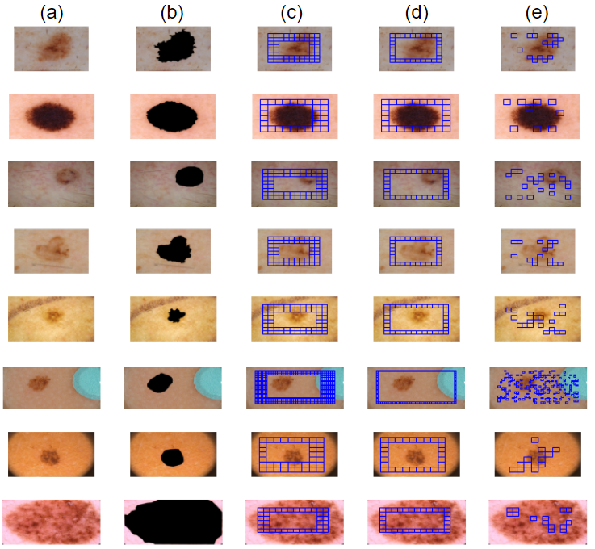
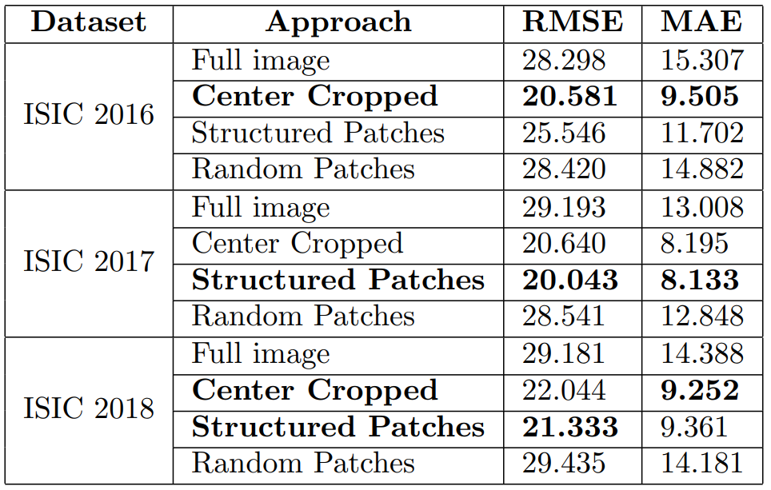

# Strategies for computing Fitzpatrick skin type to evaluate fairness in dermoscopic datasets

## Abstract

### Introduction

Artificial Intelligence (AI) and Machine learning (ML) are playing a significant role in dermatology to help improve detection of malignant skin conditions. Most AI/ML solutions, however, are trained on public datasets that contain limited or no metadata, and might be biased towards lighter skin tones. This work demonstrates how the Fitzpatrick skin type information can be automatically extracted directly from pixel values of skin lesion images without any annotation. 

### Hypothesis

The patient’s Fitzpatrick skin type can be obtained with reasonable accuracy from dermoscopic images of skin lesions even in the absence of masks delimiting the lesion area.
Methods
We used three publicly available skin lesion datasets with pixel-level annotation (segmentation masks) of the lesion areas. It can be assumed that the area not covered by those masks is healthy and can be used to assess skin tone, which might not always be true, due to the presence of artifacts such as stickers and ink marks.

We use unlabeled images and assume that segmentation masks are not available. We convert each image to a suitable color model (La*b*), compute the individual typology angle (ITA) using four different strategies, and convert the ITA value to the Fitzpatrick skin type. The proposed strategies are: (i) Full image; (ii) Center cropped; (iii) Structured patches; and (iv) Random patches (Figure 1).

Figure 1: Examples of the four proposed approaches (images are from the ISIC 2016 dataset): (a) original image; (b) masked image (used as ground truth for computation of performance metrics); (c) center cropped; (d) structured patches; and (e) random patches. Each blue square in parts (c)-(e) is considered a patch of fixed size. 

### Results

Table 1 shows experimental results. The Center Cropped and Structured Patches were the top performers across all datasets. They have both performed better than the baseline (full image) or random patches, as desired. 

Table 1: Experimental results using Root Mean Squared Error (RMSE) and Mean Absolute Error (MAE) as error metrics: lower values mean better performance. The Center Cropped strategy performed best for the ISIC 2016 dataset whereas Structured Patches performed best for ISIC 2017. For the ISIC 2018 dataset both Center Copped and Structure Patches performed well, depending on the performance metric used. 

### Conclusion

The proposed strategies for automatically computing skin tone from dermoscopic images of skin lesions in the absence of masks delimiting the lesion area can provide a reliable estimate of the patient’s Fitzpatrick type. Such information can then be used for: (i) augmenting any metadata already available for the dataset; (ii) assessing dataset imbalance relative to skin color; and (iii)  evaluating fairness and bias in datasets and AI/ML models used in dermatology. 

### Keywords
Fairness, Machine Learning, Artificial Intelligence, Dermatology, Image Analysis.

## Poster
[Poster link](https://github.com/AdamCorbinFAUPhD/dermaita.github.io/blob/gh-pages/strategies_for_computing_fitzpatrick_skin_type_poster_SIIM_2022.pptx)

### References
1. Groh, M., Harris, C., Soenksen, L., Lau, F., Han, R., Kim, A.,Koochek, A., Badri, O.: Evaluating Deep Neural Networks Trained on Clinical Images in Dermatology with the Fitzpatrick 17k Dataset. arXiv:2104.09957 [cs] (2021). 
1. Wu, Y., Tanaka, T., Akimoto, M.: Utilization of Individual Typology Angle (ITA) and Hue Angle in the Measurement of Skin Color on Images. Bioimaging Society, 8 (2020)
1. Gutman, D., Codella, N.C.F., Celebi, E., Helba, B., Marchetti, M., Mishra, N., Halpern, A.: Skin Lesion Analysis toward Melanoma Detection: A Challenge at the International Symposium on Biomedical Imaging (ISBI) 2016, hosted by the  International Skin Imaging Collaboration (ISIC). arXiv:1605.01397 [cs] (2016)
1. Codella, N.C.F., Gutman, D., Celebi, M.E., Helba, B., Marchetti, M.A., Dusza, S.W., Kalloo, A., Liopyris, K., Mishra, N., Kittler, H., Halpern, A.: Skin Lesion Analysis Toward Melanoma Detection: A Challenge at the 2017 International Symposium on Biomedical Imaging (ISBI), Hosted by the International Skin Imaging Collaboration (ISIC). arXiv:1710.05006 [cs] (2018)
1. Codella, N., Rotemberg, V., Tschandl, P., Celebi, M.E., Dusza, S., Gutman, D., Helba, B., Kalloo, A., Liopyris, K., Marchetti, M., Kittler, H.,Halpern, A.: Skin Lesion Analysis Toward Melanoma Detection 2018: A Challenge Hosted by the International Skin Imaging Collaboration (ISIC). arXiv:1902.03368 [cs] (2019).

## Source code

[https://github.com/AdamCorbinFAUPhD/derm_ita](https://github.com/AdamCorbinFAUPhD/derm_ita)

## Contact info

- Adam Corbin [acorbin3@fau.edu](mailto:acorbin3@fau.edu)
- Dr. Oge Marques [omarques@fau.edu](mailto:omarques@fau.edu)
